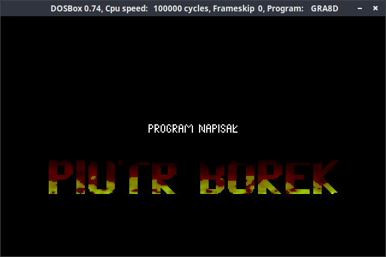
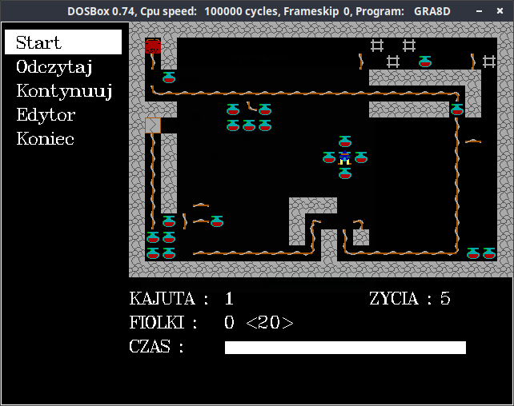

# Welcome

Hi ! This is a game I wrote in 1999.





# How to run it ?

This tutorial is for linux users, but in windows it's also easy.

## Install [dosbox](https://www.dosbox.com).

For example:

```
sudo apt-get install dosbox
```

## Configure [dosbox](https://www.dosbox.com).

Create OLDGAMES dir in your home directory:

```
mkdir OLDGAMES
```

Now, modify your dosbox configuration file. It is in "~/.dosbox" directory.

Change:

```
cycles=auto
```

to:

```
cycle=100000
```

In the autoexec section, add these lines:

```
mount c: ~\OLDGAMES
c:
```

## Copy [binaries](https://github.com/piotrborek/gra3d/raw/main/files/gra3d-bin.zip) into OLDGAMES folder and extract it.

## Run dosbox and the game.

```
cd GRA3D
GRA8D.EXE
```

## Tips.

This dosbox shortcuts are usefull:

* ALT-ENTER: switch to full-screen (and back).
* CTRL-F10: capture/release the mouse.
* CTRL-F9: kill (close) dosbox.
